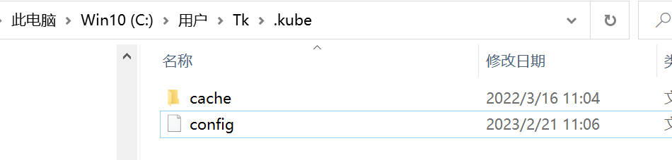
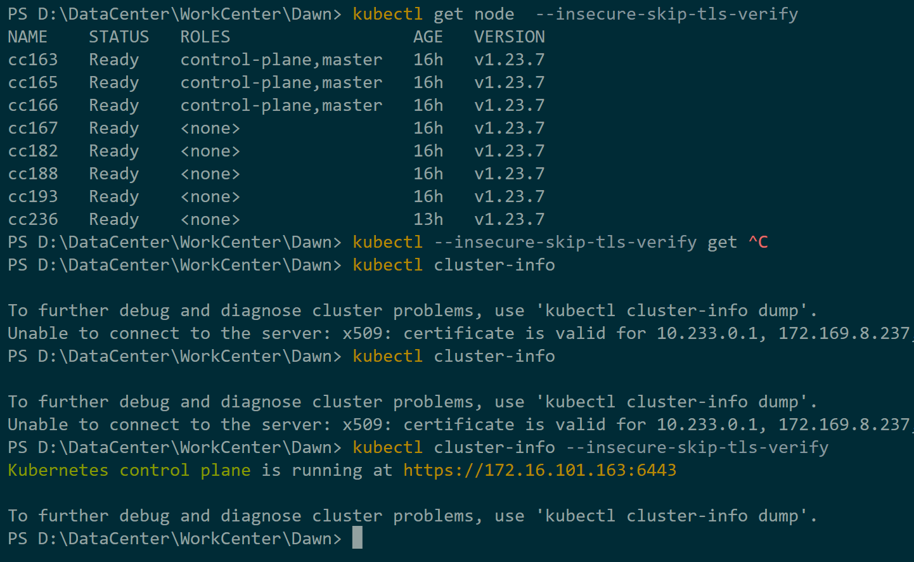

# Dawn
> Setting up your computer to access a Kubernetes cluster

[toc]

This guide will walk you through the steps of configuring your computer to access a Kubernetes cluster using the `~/.kube/config` file. We assume that you have already installed the necessary tools such as VS Code and `kubectl` on your Windows or Ubuntu machine.

## Quick Reference

1. Obtain the Kubernetes configuration file
2. Set up your environment
3. Configure `kubectl` to use your `~/.kube/config` file
4. access service via nodeport
5. we recommend that create namespace for your group, like group "yanying" is preserved for me, and **do not** change namespace not belongs to you.

## Step 1: Obtain the Kubernetes configuration file

The `~/.kube/config` file contains the configuration settings for accessing a Kubernetes cluster. You will need to obtain this file from the administrator of the Kubernetes cluster you wish to access.

1. Contact your Kubernetes cluster administrator to request access to the cluster and obtain the `~/.kube/config` file.
2. Save the `~/.kube/config` file to your local machine in a location you can easily access.

## Step 2: Set up your environment
> make sure your installed kubectl version >= 1.23.0

1. For Ubuntu:
    ~~~
    sudo snap install kubectl --classic
    ~~~

2. For Windows:
Download and install `kubectl` from the official Kubernetes website: https://kubernetes.io/docs/tasks/tools/install-kubectl-windows/

3. Open VS Code and navigate to the terminal window.

## Step 3: Configure `kubectl` to use your `~/.kube/config` file

1. In the VS Code terminal, run the following command to ensure that `kubectl` is installed: 
    ~~~
    kubectl version --insecure-skip-tls-verify
    ~~~ 
2. Copy your `~/.kube/config` file to the default location for `kubectl` by running the following command:
    ~~~
    cp /path/to/your/config ~/.kube/config
    ~~~
3. Verify that `kubectl` is configured to use your `~/.kube/config` file by running the following command:
    ~~~
    kubectl cluster-info --insecure-skip-tls-verify
    ~~~

If everything was successful, you should now be able to access your Kubernetes cluster using `kubectl` on your local machine. You can run `kubectl` commands to manage and interact with the cluster.
+ in windows:
    make sure your config file in the correct path:
    

    ~~~
    kubectl get nodes --insecure-skip-tls-verify
    ~~~
    

    **!Note**: since I config a IP address that we could directly access to cluster in F1, we need to use `--insecure-skip-tls-verify` to skip the TLS verification. or, you could create yourself a container using kubernetes, and config using **Step 2. Ubuntu**  to access to cluster.

Congratulations, you have now configured your local machine to access a Kubernetes cluster using the `~/.kube/config` file! If you encounter any issues or have any questions, please reach out to the Kubernetes cluster administrator or refer to the Kubernetes documentation for more information.

## Step 4: Access the Kubernetes Dashboard and Other Services

You can access the Kubernetes Dashboard and Other Services by using the `kubectl proxy` command. This command will create a proxy server that will allow you to access the Kubernetes Dashboard and other services using a web browser.

You should expose and determine a port in your local machine that you can use to access the Kubernetes Dashboard and other services. For example, you can use port 8001, and do not forget to `--insecure-skip-tls-verify`.

if you use kubectl proxy, you can access to cluster using `http://localhost:8001` in your browser.

I recommend that you you can using "NodePort" to access to cluster.

**Note:** You can directly access the Kubernetes service using the IP Address 172.16.101.163:[port]. [port] is the port number you specified in the service configuration file. For example, you can access the Kubernetes Dashboard using the following URL: https://172.16.101.163:31443/ using following token:
~~~
Access token: will be sent via email if you need it. only the coming committee would recive the token.
~~~

## Q&A

1. Please drop me an email if you have any questions about access right, and cert: [email protected]. 
For questions like "how to use nodeport", **I would prefer to discuss them via GitHub**, as it provides a platform for documentation and better organization of our discussions.

2. Develop and operate issues and questions, you could raise an issue in this repo via following format:
    ~~~
    Title: [Issue] [Service Name] [Issue Description]
    Body: [Issue Description]

    0. your develop&ops environment, like 172.20.110.x, win10, vscode etc. to make us easy understand your issue; 
    1. The process leading you to this issue, the more specific, the better. [use figures if you have]
    2. Your expected result.
    3. what have you tried, method and logs when you try to handle this issue.
    ~~~
3. **We are waiting for volunteers to participate in the maintenance, feel free to email me if you are interested in.**  Committee will take part in organize servers, will have the right to access the physical machine and have fully right to the whole cluster. and will response for following matters:
    + Update this repo if needed.
    + Manage spark cluster and K8S cluster, install some auxiliary applications.
    + Monitor the applications in this cluster to prevent attacks and chaotic use of resources, such as loading applications under other users' namespaces.
    + Other arrangements for running the cluster, such as the need for additional machines, reinstallation of systems, and nominations for the next boundary committee.

4. If you have any advice or revision in README file or cluster settings config, fork this repo and pull request, thx.